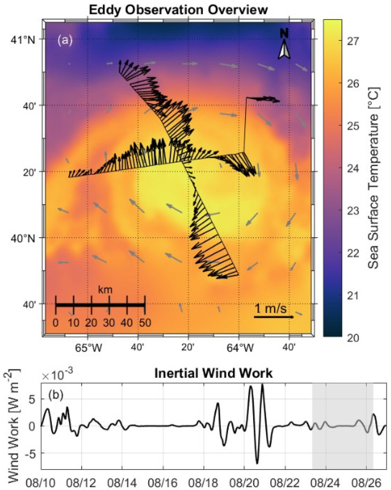
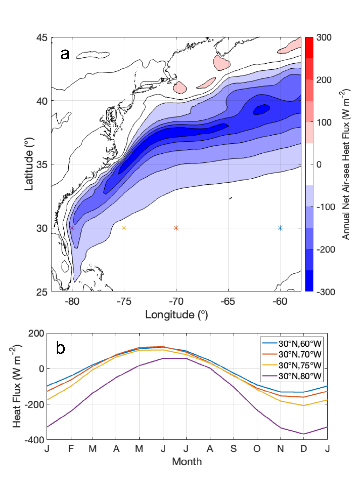
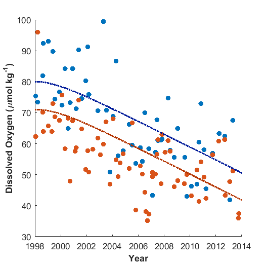

## Portfolio

---

### Recent Projects

[Observations of Turbulence Generated by a Near-Inertial Wave Propagating Downward in an Anticyclonic Eddy](https://doi.org/10.1029/2024GL114070) 

--

[Springtime Warming by Ocean Advection in the Gulf Stream](https://doi.org/10.1029/2024GL111000) 

---

[Drift Characteristics of Sea-Bird Dissolved Oxygen Optode Sensors](https://doi.org/10.1175/JTECH-D-22-0103.1)  

---

[Warming and Lateral Shift of the Gulf Stream from In Situ Observations Since 2001](https://doi.org/10.1038/s41558-023-01835-w) 

---
[Dissolved Oxygen Observations from Spray Underwater Gliders](https://drive.google.com/file/d/1TsWagoaGzxQO_-fVW0rH-KTM47Pb-Hhc/view?usp=sharing)
This seminar was recorded at Woods Hole Oceanographic Institution on Jan 10, 2023.

---
[Across-shore Propagation of Subthermocline Eddies in the California Current System](https://doi.org/10.1175/JPO-D-21-0137.1)

---
[Salinity and Temperature Extremes in the California Current System](https://doi.org/10.1038/s43247-021-00131-9)

---
[Oceanic Dissolved Oxygen Declines](https://doi.org/10.1038/s41598-018-25341-8)

---

### Archived Projects

<!-- - [Project Here](websiteurl) -->

---

---

Page template forked from <a href="https://github.com/evanca/quick-portfolio">evanca</a>

<!-- Remove above link if you don't want to attibute -->
